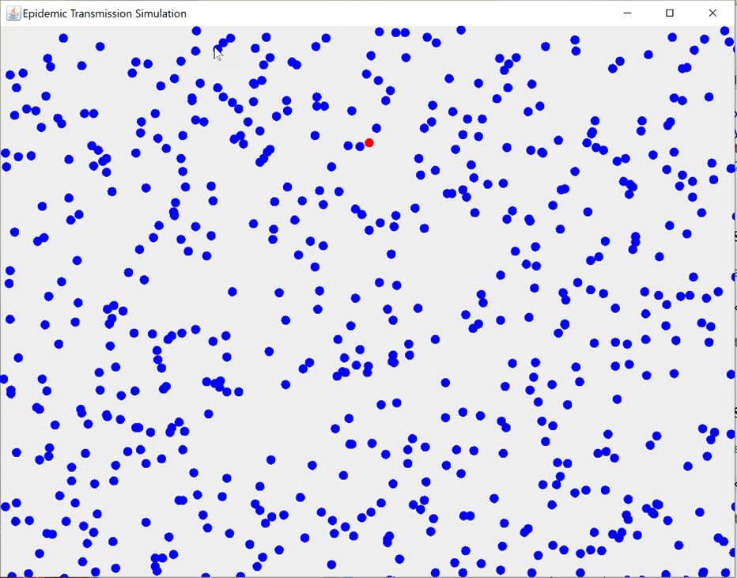
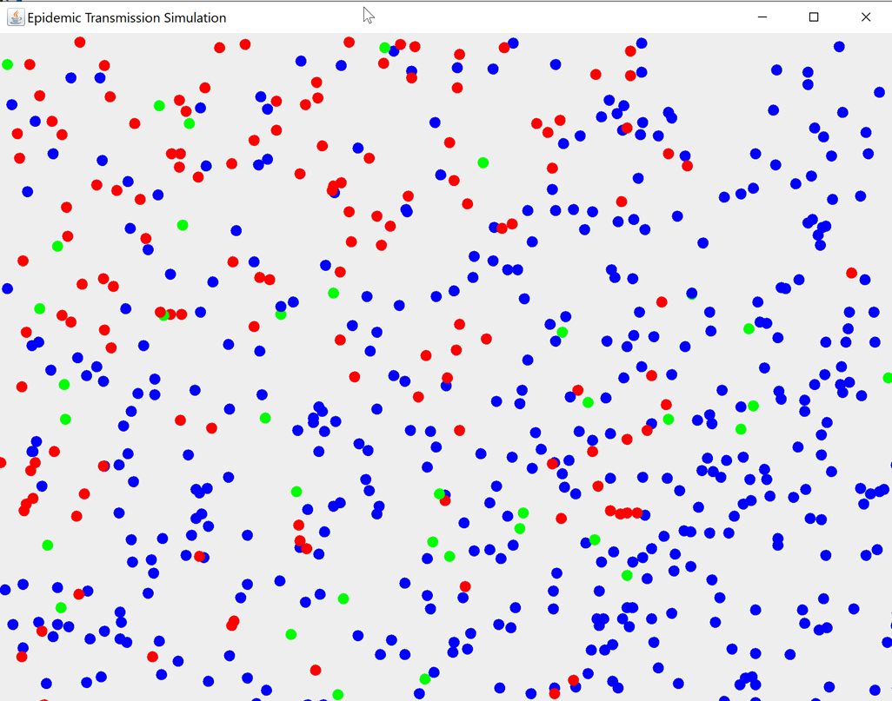

# PandemicSimulator

<table class=MsoNormalTable border=1 cellspacing=0 cellpadding=0
 style='border-collapse:collapse;border:none'>
 <tr>
  <td valign=top style='border:solid windowtext 1.0pt;'>
  
Course:

  </td>
  <td valign=top style='border:solid windowtext 1.0pt;
  border-left:none;'>
  
INFO-3136
  Summer 2022

  </td>
 </tr>
 <tr>
  <td align=top style='border:solid windowtext 1.0pt;
  border-top:none;'>
  
Professor:

  </td>
  <td valign=top style='border-top:none;border-left:
  none;border-bottom:solid windowtext 1.0pt;border-right:solid windowtext 1.0pt;'>
  
Bill
  Pulling

  </td>
 </tr>
 <tr>
  <td valign=top style='border:solid windowtext 1.0pt;
  border-top:none;padding:0in 5.4pt 0in 5.4pt'>
  
Project:

  </td>
  <td valign=top style='border-top:none;border-left:
  none;border-bottom:solid windowtext 1.0pt;border-right:solid windowtext 1.0pt;
  padding:0in 5.4pt 0in 5.4pt'>
  
Pandemic
  Simulator Application Ver. 1.1

  </td>
 </tr>
 <tr>
  <td valign=top style='border:solid windowtext 1.0pt;
  border-top:none;padding:0in 5.4pt 0in 5.4pt'>
  
Due
  Date:

  </td>
  <td valign=top style='border-top:none;border-left:
  none;border-bottom:solid windowtext 1.0pt;border-right:solid windowtext 1.0pt;
  padding:0in 5.4pt 0in 5.4pt'>
  
Saturday,
  August 6, 2022, by <u>8:00 p.m. (2000 hours)</u>

  </td>
 </tr>
 <tr>
  <td valign=top style='border:solid windowtext 1.0pt;
  border-top:none;padding:0in 5.4pt 0in 5.4pt'>
  
Service
  Packs:

  </td>
  <td valign=top style='border-top:none;border-left:
  none;border-bottom:solid windowtext 1.0pt;border-right:solid windowtext 1.0pt;
  padding:0in 5.4pt 0in 5.4pt'>
  
SERVICE PACK 1 July 28: clarifies the immunity status of people
  who get infected and recover. See page 3.

  </td>
 </tr>
 <tr>
  <td valign=top style='border:solid windowtext 1.0pt;
  border-top:none;padding:0in 5.4pt 0in 5.4pt'>
  
Submitting:

  </td>
  <td valign=top style='border-top:none;border-left:
  none;border-bottom:solid windowtext 1.0pt;border-right:solid windowtext 1.0pt;
  padding:0in 5.4pt 0in 5.4pt'>
  
See
  last page for instructions.

  </td>
 </tr>
</table>

Note: This project may be done individually<u>
</u><i><u>but it is
strongly recommended that you do it with a partner or in a group of three to
five</u></i><u>!</u> If you do partner up with others, give yourselves a "company
name", and ensure that all names are included in the doc header of each and
every class you submit. 

The science of
epidemiology is defined as "<i>the branch of medicine which deals with the
incidence, distribution, and possible control of diseases and other factors
relating to health</i>" (from the Oxford English dictionary online edition).

The difference between
an epidemic and a pandemic is one of geographical scale. An epidemic typically
is an outbreak of a disease that is localized to one geographic area. A
pandemic consists of multiple outbreaks of the disease spread over several
continents. The age of international air travel has made it much easier for a
disease to transition from a local epidemic into a worldwide pandemic in a very
short time. 

As computing technology
has advanced over the past fifty years, computer programs designed to model the
spread of diseases through a population have become important tools in attempts
to control epidemics and pandemics of contagious diseases. Pandemic simulations
based on how a disease is transmitted can help medical authorities recommend
various counter-measures such as wearing masks, physical distance rules, and
whether certain activities in a society (such as attending school classes, or
going to restaurants or concerts) should be limited or even stopped completely.

Such simulation
software has been used by the government medical authorities in Ontario to
advise the government on their response to the current COVID-19 pandemic. 

<b>Your
Mission:</b>

You task is to build a
GUI application that will allow the user to input certain parameters about a
population in terms of how many people are vaccinated or unvaccinated, and then
run a simulation to see how quickly a disease will spread through a population
of a given size. The application will simulate a period of three weeks in which
there will be one infected person in the population at the start of the
simulation. Then, this infected person will interact with the rest of the
population and we will be able to see how the disease can spread, based on
certain assumptions about the level of protection against the disease in the
rest of the population ( i.e.from being vaccinated, or from having already had
the disease and thereby acquiring some natural immunity, although with the recent
Omicron variants and sub-variants, even getting the disease once does not
guarantee that you won"t be re-infected.).

NOTE: the mathematics
behind pandemic simulation software can actually be quite complex, but we are
going to be using fairly simple assumptions related to how probable it is that
one individual could contract the disease from an infected individual. 

ON the next page are
some screen shots from an early prototype. 

 

&nbsp;

The first screen shot
shows the start of the simulation with just one infected person (the red dot)
in a population of 600 uninfected (the blue dots) people. As the simulation
progresses, the dots will all move about the screen randomly by distances of up
to 5 pixels.

This next screen shot
shows the situation after about 150 cycles of the simulation, which is about 30
seconds later, based on a Timer object lag time interval of 200 milliseconds,
which means the screen gets redrawn about 5 times per second.

On this screen, the red
dots are infected persons. The blue dots are uninfected persons. The green dots
are infected persons who have recovered from the disease after about 150 cycles, and are no longer infectious. Not seen on
this screen are any black dots, which indicate an infected person has died from
the disease. 

As the simulation runs,
collisions will occur between the moving dots. If an infected dot collides with
an uninfected, unvaccinated person, then in our simulation there is an 80%
chance that the uninfected person will become infected and also start spreading
the disease. 

<b>The Details</b>

In the simulation, a
person infected status can either be true(infected) or false(not infected). On
the screen shots a red dot represents an infected person.

A person"s <b>immunity
status</b> can be in one of several different states, which are mutually
exclusive.  
 
1) a person is not vaccinated, and has not had the disease and therefore has no
immunity.

2) a person has had only
one shot of a two dose vaccine and has mild immunity.

3) a person has had
both shots of a two dose vaccine and has moderate immunity.

3) a person has had a
third booster shoot and has good immunity.

4) a person has had the
disease and has recovered, so that they have mild "natural immunity".

Now, even if a person
has had three doses of the vaccine or have acquired natural immunity, they
could still contract the disease and become spreaders, although the probability
of this happening will be lower than for any unvaccinated persons, as will be
detailed in the next section. 

<b>Probabilities of Getting Infected</b>

As this is the summer
of 2022, we are going to assume that the dominant strain of the disease
circulating is the omicron strain and its sub-variants such as Ba-4 and Ba-5.
These variants have mutated somewhat from the original COVID-19 virus and are
better able to evade the immunity offered by the current vaccines in use. So, the
probability rules that we"ll use in this simulation for possible transmission
from an infected person to an uninfected person are based on a person"s
immunity status as follows: 
 
1) No immunity: If an infected person collides with an uninfected person who
has no immunity, then there is an 80% chance that the disease will be passed on
to the uninfected person.

2) One shot of vaccine:
If an infected person collides with an uninfected person who has had ONE shot
of the vaccine, then there is a 60% chance that the disease will be passed on
to the uninfected person.

3) Two shots of
vaccine: If an infected person collides with an uninfected person who has had
BOTH shots of the vaccine, then there is a 30% chance that the disease will be
passed on to the uninfected person.

4) Third booster shot
of vaccine: If an infected person collides with an uninfected person who has
had a third booster shot of the vaccine, then there is a 10% chance that the disease
will be passed on to the uninfected person.

5) If an infected
person collides with a person <i>who has had the disease and recovered and has
some mild natural immunity</i> (a green dot on the screen shot) then there is a
40% chance that the this person with mild natural immunity will be infected. 

SERVICE PACK DETAILS: 
Question: what if a person
already had one or more shots, contracted the disease, and then
recovered...what is their level of immunity after they&nbsp; recover?&quot;

OK, simplest solution here is
this...if the&nbsp; recovered person had not had any vaccinations at all before
they were infected, then assign them natural immunity status so they have a 40%
chance of re-infection.

If the person had just one
vaccination, then they originally had a 60% chance of infection. So, after
recovery, we should adjust their immunity to natural immunity status to a 40%
chance of re-infection, as this is an improvement over just one-shot
vaccination status.

For all other cases of
vaccination status where they have had the second and third shot,&nbsp;just leave
their status at the same immunity level&nbsp; that they had, because two-shot
and three-shot immunity it is better than the natural immunity level.

&nbsp;

<b>What You Need to Do to Get
Started</b>:

You need to write a
Person class that you can use to create an array of Person objects, which can
be drawn as colored dots on the screen. Rather than give you a specific UML
diagram for this, I am going to leave the class design up to you, but here are
a few hints to help you along the way. 

Some data members that you
might want to include in the class would be: 

<b>-isAlive (boolean)</b>: if the object is alive it can move and can be
infected. If it is dead, it turns black and stops moving 

<b>-isInfected(boolean)</b> : set this to true if the object gets infected by
another person object.

<b>-immunityStatus(int)</b>: an int value that can range from 1 to 5 based on
the descriptions noted above. This determines the likelihood of an uninfected
object becoming infected if they collide with an infected object. The number of
person objects in each immunity state will be determined by an input by the
user of the program. For example if the user wants to run a simulation in which
nobody has any immunity, then they would enter this into the program before
running the simulation and specify that everyone in the population has no immunity.
Alternatively, the user may want to specify that 20% of the population has one
shot immunity, 40% has 2-shot immunity, 10% has natural immunity, and the
remaining 30% has no immunity. You will have to figure out how to create an
array of Persons with this distribution. Also, when the user enters the
immunity values, you will have to do some data validation to ensure that the
percentages add up to 100%.

<b>-color(Color):</b> used to determine what color will be used when
the object is rendered to the screen. The graphics object g should use this
value to draw the object on the screen. You can color-code your objects using
the suggested following color scheme:

For infected objects,
RED is the obvious color to use. 
For dead objects, BLACK is the obvious color to use. 
 
For uninfected objects, you could use different colors to represent different
levels of immunity.  
For objects with no immunity, you could use BLUE.  
For objects with one shot immunity, you could use CYAN. 
For objects with two shot immunity, you could use YELLOW 
For objects with three shot immunity you could use MAGENTA.

For infected objects
that have recovered, GREEN can be used to signify their status as having mild
natural immunity.

NOTE: one of the things
you should add to your visual display is a legend to indicate what each color
represents.

<b>-xCoordinate(int)
and yCoordinate(int):</b> these will
hold the position where the object will be drawn on the drawing panel. These
are randomly generated when the object is instantiated. "At instantiation time
these values should be randomly generated and assigned so that a particular
Person object could be drawn anywhere on the drawing surface. You should ensure
that the values are within a range so that a person object will not be placed
outside of the drawing surface of your JPanel. 

<b>-xIncrementValue(int)
and yIncrementValue(int):</b> these
represent the number of pixels that the object will "move" in each drawing
cycle. The value of each can range from -5 to +5 pixels.. These values will also
be randomly modified <i>if the object collides with another object</i> so that
the objects will probably change direction after the collision. 

<b>-cycleCounter(int)</b> : this is used to determine how long an infected
object remains infections. It starts at zero and <b>only starts</b> <b>incrementing
</b>when the object"s infected status changes to true. One of the assumptions
we"ll use in our model is that an infected person will be infectious for a
maximum of 7 days, so we"ll arbitrarily set the end of the infectious stage at
a count as 150 cycles, at which an infected person"s status will change to
green, if they have not died first. 

NOTE: you are not
limited to the data members listed above. If you can think of other data
members that you might find useful, you can add them in, but be sure to
document WHY and WHAT the new variables will be used to do.

All the data members
should be private, and you should provide whatever getters and setters you
think are necessary. 

<b>Methods to Consider:</b>

You will need at least
one constructor method, but you can have more if you think you need them.

You will need a <b>move()</b>
method to calculate the new positions for each object for each drawing cycle. 

Also, you will need a <b>checkCollision()</b>
method to check to see if a collision has occurred between two objects. If it
has, you will need some code to determine what state variables should be
changed for the objects involved. Two variables that should be <i>randomly changed
for both objects involved in a collision are the xIncrementValue and the yIncrementValue</i>
so that the objects will have their direction of travel altered randomly.
Remember that these two values should range from -5 to +5. 

<b>You can add any
other methods as required</b> to
accomplish whatever functions you need to do, but make sure the methods are
COMPLETELY DOCUMENTED so I know what the logic is doing.

<b>Probability of Death
From Infection.</b>

<b>You also need</b> to determine if any infected dots live or die. "ONLY
AFTER an infected object has stopped being infectious (150 cycles from when it
got infected), there is a probablility that the infected dot will die,
depending on its immunity status. 
An unvaccinated person has a 10% chance of dying. 
A one shot vaccinated person has a 7% chance of dying. 
A two shot vaccinated person has a 3% chance of dying. 
A three shot vaccinated person has a 1% chance of dying. 
A person who had the disease, recovers with mild natural immunity, and<b> </b>then
catches the disease again has a 3% chance of
dying.

If the person object
does die, then its color should be set to black, and its xIncrementValue and
yIncrementValues should be set to zero so that it stops moving.

<b>User Input Parameters</b>

The user should be able to vary the input
parameters listed below:

1)&nbsp;
Size of the population: Our
drawing area could represent some physical space, such as a college campus, a
shopping centre, or a factory or warehouse space. The user might want to run a
simulation with just a few hundred persons, or with a few thousand persons in
the space to see how the number of persons in the space affects the spread of
the disease. "

2)&nbsp;
Levels of immunity for
specified percentages of the population: The user might want to assume that no
one is vaccinated, and then run a simulation. Then, they might want assume that
50% of the population has had both shots, and see the effect on the outcome.
The user should be able to say "I want 25% with no immunity, 25% with one shot,
25% with two shots, and 25% who have recovered and have natural immunity. 

3)&nbsp;
We"ll leave it up to you to
determine how to get the user input here, but remember Schneiderman"s 8 Golden
Rules of User Interface Design. Try to avoid having the user type data into
text fields if you can. There are lots of ways to get numeric input without
requiring the user to enter it in a text field.

4)&nbsp;
PAUSE and RESUME controls: the
user may wish to pause the simulation part way through to examine certain data outputs.
A simple way to do this is to just call the stop() method of your Timer object.
It will stop firing ActionEvents, which should stop the drawing process. When
the user wants" to resume the simulation, they can just call the Timer object"s
start() method to resume. "

<b>Duration of the
Simulation</b>

To make the simulation
run in a reasonable amount of time, we can make the following assumptions:

1) our lag time between
screen repaints should be set to about 200 milliseconds. You can vary this up
and down a bit if you feel that you need to, but 200 milliseconds seems to give
a good visual display. This will result in the screen being repainted about 5
times per second. So, we will get about 300 repaint cycles in one minute of
running time. 

2) We would like the
simulation to represent a 21 day period. We will arbitrarily say that 150 repaint
cycles will represent 7 calendar days, so a complete simulation of 450 cycles
would represent a 21 day period. So we will set the number of repaint cycles to
be done to around 450. This means so that one run of the simulation will take
about 90 seconds and will represent a 21 day period. 

<b>Data Display on the GUI</b>

The previous screen
shots just show the drawing surface and the interactions of the Person objects
and did not show any results data. 

Before the simulation
starts, the following data should be displayed in some sort of "dashboard" or
data area on the screen:

1) total number of
persons in the population. This is input by the user at the start.

2) <i>percentage </i>of
unvaccinated persons in the population, <i>percentage</i> of one shot
vaccinated persons, the <i>percentage</i> of two shot vaccinated persons, the <i>percentage</i>
of three shot vaccinated persons, and the <i>percentage</i> of persons who have
mild natural immunity from a previous infection. All of these percentages will
also be input by the user. 

NOTE: when the user
enters these values, you will need to keep track of them so that the total of
the percentages of each category of person does not exceed 100% of the size of
the population. 

&nbsp;

After the user presses
the START button, we would like to see the following data <i>updated in real
time as it changes:</i>

1)&nbsp;
Number of infected persons.

2)&nbsp;
Number of non-vaccinated
persons infected.

3)&nbsp;
Number of one-shot-vaccinated
people infected.

4)&nbsp;
Number of two-shot-vaccinated
people infected.

5)&nbsp;
Number of three-shot-vaccinated
people infected.

6)&nbsp;
Number of naturally immune people
who have been re-infected.

7)&nbsp;
Number of infected people who
have recovered.

8)&nbsp;
Number of infected people who
have died. 
 

<b>Final Data
Presentation</b>

After the simulation
has finished, use the data generated to calculate and display this information:

1)&nbsp;&nbsp;&nbsp;&nbsp;&nbsp;
Percentage of the total
population that contracted the disease.

2)&nbsp;&nbsp;&nbsp;&nbsp;&nbsp;
Percentage of unvaccinated
persons who contracted the disease.

3)&nbsp;&nbsp;&nbsp;&nbsp;&nbsp;
Percentage of one-shot-vaccinated
persons who contracted the disease.

4)&nbsp;&nbsp;&nbsp;&nbsp;&nbsp;
Percentage of two-shot-vaccinated
persons who contracted the disease.

5)&nbsp;&nbsp;&nbsp;&nbsp;&nbsp;
Percentage of three-shot-vaccinated
persons who contracted the disease.

6)&nbsp;&nbsp;&nbsp;&nbsp;&nbsp;
Percentage of those naturally
immune persons who got re-infected.

7)&nbsp;&nbsp;&nbsp;&nbsp;&nbsp;
Percentage of all those who
contracted the disease that recovered.

8)&nbsp;&nbsp;&nbsp;&nbsp;&nbsp;
Death Rate Percentage of all
those who contracted the disease that died, broken down by their immunity
status. 
So, for example, if there were 100 unvaccinated persons and 50 got infected,
and 5 died, the percentage death rate for unvaccinated persons would be 5/100
or 5%.

<b>Menu System</b>

Include a menu system
that, at a minimum, allows the user to start and stop the simulation, and also
has an "About" menu, which will list the names of each member of the project
team.

<b>Bonus Marks
Available</b>:

There are two bonus
marks available. If you are feeling creative, you could also try to present the
data in some sort of graphical format. For example, you might show the number
of cases per day over the three week period. This is not a functional
requirement, but could be done to gain a bonus mark or two.

Another bonus option
would be to generate some sort of report listing the inputs and results that
could be saved as a text file and sent to a user designated file. 

<b> 
</b>

<b>&nbsp;</b>

<b>Submitting your project:</b>

Since you will likely have
several .java source files in this project, you should submit your ENTIRE
ECLIPSE PROJECT folder by zipping it up and then submitting it to the drop box.
All source files should include a proper documentation header comments listing
the names, student numbers, and section numbers of each person in the group. 

<b>Submit
your project on time! </b>

Project submissions
must be made on time! Late projects will be subject to the following late
policy:

Up to
one day (24 hours) late: 10% reduction

A
further 10% reduction for each additional day late up to a maximum of 5 days.

After
five days late: mark of zero is assigned. 

<b> 
</b>

How
will my project be marked?

"&nbsp;&nbsp;&nbsp;&nbsp;&nbsp;&nbsp;&nbsp;&nbsp;
This project counts for 10% of your final mark and will be graded using
to the following grid: 

&nbsp;

<table class=MsoNormalTable border=1 cellspacing=0 cellpadding=0
 style='border-collapse:collapse;border:none'>
 <tr>
  <td width=77 valign=top style='border:solid windowtext 1.0pt;
  padding:0in 5.4pt 0in 5.4pt'>
  
<b>Marks 
  Available</b>

  </td>
  <td valign=top style='border:solid windowtext 1.0pt;
  border-left:none;padding:0in 5.4pt 0in 5.4pt'>
  
<b>What are the marks awarded for?</b>

  </td>
  <td width=78 valign=top style='border:solid windowtext 1.0pt;
  border-left:none;padding:0in 5.4pt 0in 5.4pt'>
  
<b>Mark Assigned</b>

  </td>
 </tr>
 <tr>
  <td width=77 valign=top style='border:solid windowtext 1.0pt;
  border-top:none;padding:0in 5.4pt 0in 5.4pt'>
  
1

  </td>
  <td valign=top style='border-top:none;border-left:
  none;border-bottom:solid windowtext 1.0pt;border-right:solid windowtext 1.0pt;
  padding:0in 5.4pt 0in 5.4pt'>
  
Good coding style including proper indentation and use
  of variable and class naming conventions and suitable commenting.

  
 
   
  

  
&nbsp;

  </td>
  <td width=78 valign=top style='border-top:none;border-left:
  none;border-bottom:solid windowtext 1.0pt;border-right:solid windowtext 1.0pt;
  padding:0in 5.4pt 0in 5.4pt'>
  
&nbsp;

  </td>
 </tr>
 <tr>
  <td width=77 valign=top style='border:solid windowtext 1.0pt;
  border-top:none;padding:0in 5.4pt 0in 5.4pt'>
  
&nbsp;

  </td>
  <td valign=top style='border-top:none;border-left:
  none;border-bottom:solid windowtext 1.0pt;border-right:solid windowtext 1.0pt;
  padding:0in 5.4pt 0in 5.4pt'>
  
<b>GUI Design and Layout</b>

  </td>
  <td width=78 valign=top style='border-top:none;border-left:
  none;border-bottom:solid windowtext 1.0pt;border-right:solid windowtext 1.0pt;
  padding:0in 5.4pt 0in 5.4pt'>
  
&nbsp;

  </td>
 </tr>
 <tr>
  <td width=77 valign=top style='border:solid windowtext 1.0pt;
  border-top:none;padding:0in 5.4pt 0in 5.4pt'>
  
6

  </td>
  <td valign=top style='border-top:none;border-left:
  none;border-bottom:solid windowtext 1.0pt;border-right:solid windowtext 1.0pt;
  padding:0in 5.4pt 0in 5.4pt'>
  
GUI Design is well laid out and easy to use and
  navigate. 
   
  -minimal use of text fields for data input 
   
  -good use of screen space, layout is well balanced 
   
  -has a menu system with basic instructions, and an "About" screen listing the
  names of all persons on the project team. 
   
   
  

  </td>
  <td width=78 valign=top style='border-top:none;border-left:
  none;border-bottom:solid windowtext 1.0pt;border-right:solid windowtext 1.0pt;
  padding:0in 5.4pt 0in 5.4pt'>
  
&nbsp;

  </td>
 </tr>
 <tr>
  <td width=77 valign=top style='border:solid windowtext 1.0pt;
  border-top:none;'>
  
&nbsp;

  </td>
  <td valign=top style='border-top:none;border-left:
  none;border-bottom:solid windowtext 1.0pt;border-right:solid windowtext 1.0pt;
  padding:0in 5.4pt 0in 5.4pt'>
  
<b>Functionality</b>

  </td>
  <td width=78 valign=top style='border-top:none;border-left:
  none;border-bottom:solid windowtext 1.0pt;border-right:solid windowtext 1.0pt;
  padding:0in 5.4pt 0in 5.4pt'>
  
&nbsp;

  </td>
 </tr>
 <tr>
  <td width=77 valign=top style='border:solid windowtext 1.0pt;
  border-top:none;padding:0in 5.4pt 0in 5.4pt'>
  
13

  </td>
  <td valign=top style='border-top:none;border-left:
  none;border-bottom:solid windowtext 1.0pt;border-right:solid windowtext 1.0pt;
  padding:0in 5.4pt 0in 5.4pt'>
  
User is able to set the various parameters as
  specified.

  
 
  data validation is done where necessary.

  
 
  -simulation runs and produces reasonable results based on inputs. 
   
  -simulation results are updated in real time and clearly presented. 
   
  - final data display is complete according to specifications

  
&nbsp;

  </td>
  <td width=78 valign=top style='border-top:none;border-left:
  none;border-bottom:solid windowtext 1.0pt;border-right:solid windowtext 1.0pt;
  padding:0in 5.4pt 0in 5.4pt'>
  
&nbsp;

  </td>
 </tr>
 <tr>
  <td width=77 valign=top style='border:solid windowtext 1.0pt;
  border-top:none;padding:0in 5.4pt 0in 5.4pt'>
  
20 
   
  

  </td>
  <td valign=top style='border-top:none;border-left:
  none;border-bottom:solid windowtext 1.0pt;border-right:solid windowtext 1.0pt;
  padding:0in 5.4pt 0in 5.4pt'>
  
TOTAL

  </td>
  <td width=78 valign=top style='border-top:none;border-left:
  none;border-bottom:solid windowtext 1.0pt;border-right:solid windowtext 1.0pt;
  padding:0in 5.4pt 0in 5.4pt'>
  
&nbsp;

  </td>
 </tr>
 <tr>
  <td width=77 valign=top style='border:solid windowtext 1.0pt;
  border-top:none;padding:0in 5.4pt 0in 5.4pt'>
  
2

  </td>
  <td valign=top style='border-top:none;border-left:
  none;border-bottom:solid windowtext 1.0pt;border-right:solid windowtext 1.0pt;
  padding:0in 5.4pt 0in 5.4pt'>
  
<b>Bonus Marks</b>: will be assigned at instructor"s discretion
  for outstanding features beyond the basic requirements 
   
   
   
  

  </td>
  <td width=78 valign=top style='border-top:none;border-left:
  none;border-bottom:solid windowtext 1.0pt;border-right:solid windowtext 1.0pt;
  padding:0in 5.4pt 0in 5.4pt'>
  
&nbsp;

  </td>
 </tr>
 <tr>
  <td width=77 valign=top style='border-top:none;border-left:
  solid windowtext 1.0pt;border-bottom:double windowtext 1.5pt;border-right:
  solid windowtext 1.0pt;padding:0in 5.4pt 0in 5.4pt'>
  
&nbsp;

  </td>
  <td valign=top style='border-top:none;border-left:
  none;border-bottom:double windowtext 1.5pt;border-right:solid windowtext 1.0pt;
  padding:0in 5.4pt 0in 5.4pt'>
  
GRAND TOTAL

  </td>
  <td width=78 valign=top style='border-top:none;border-left:
  none;border-bottom:double windowtext 1.5pt;border-right:solid windowtext 1.0pt;
  padding:0in 5.4pt 0in 5.4pt'>
  
&nbsp;

  </td>
 </tr>
</table>

&nbsp;

